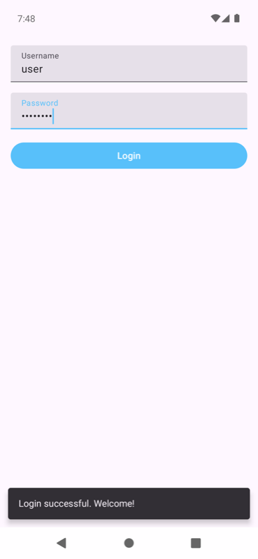
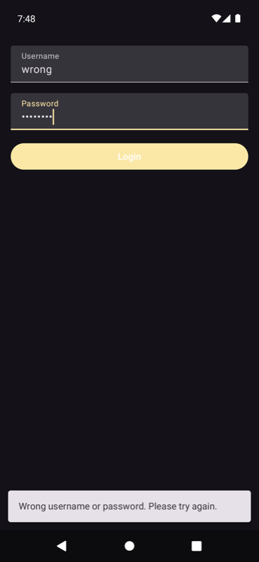
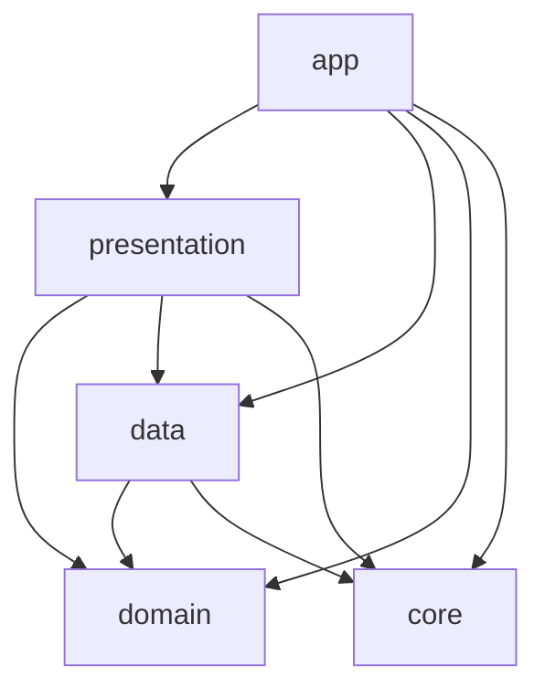

# LoginApp

[](https://github.com/yehor-levchenko/LoginApp/actions/workflows/android.yml)

## Table of contents

- [About](#about)
  - [Screenshots](#screenshots)
  - [Design decisions](#design-decisions)
- [Architecture](#architecture)
  - [Modules](#modules)
  - [Module dependencies](#module-dependencies)
  - [Data source](#data-source)
- [Tech stack](#tech-stack)
- [Testing](#testing)
  - [Test coverage](#test-coverage)
  - [Test credentials](#test-credentials)
- [Getting started](#getting-started)

## About

A simple Android login screen, developed as part of a code challenge:
https://drive.google.com/file/d/1gGGKNUZOpxIf8mPY0P-efKGL-GQzklB5/view?usp=share_link

The goal of this project is not to create an app that solves a real-world problem, but rather to
demonstrate a part of my hard skills and a deep understanding of Android application architecture.

The project is designed to be reliable, stable, highly testable, and easily extendable. However,
due to the simplicity of the task, I deliberately deviated from certain Clean Architecture
principles in order to avoid making the project needlessly complex or inappropriate for its scope.

I am happy to explain any decision made in this project, as well as what I would add, change,
or improve if this were a production-level project. Feel free to reach out to discuss or
challenge any of them.

### Screenshots

| Successful login (light theme)                          | Wrong credentials (dark theme)                     |
|---------------------------------------------------------|----------------------------------------------------|
|  |  |

### Design decisions

- **Unidirectional data flow.** `LoginViewModel` exposes a single immutable `LoginUiState` via
  `StateFlow` and accepts user actions through a single `onUserEvent` entry point, where every
  action is described by the sealed `LoginEvent.UserEvent` interface.
- **One-off UI events as part of state.** Messages are delivered as `LoginEvent.UiEvent` inside
  `LoginUiState` and are removed after the UI reports them as performed. Unlike `Channel` or
  `SharedFlow`, this approach does not lose events on configuration changes or when the UI is
  not collecting.
- **No `Context` in the ViewModel.** Messages are modeled by the sealed `LoginMessage` class that
  holds string resource IDs, which are resolved in the UI layer.
- **Validation in the domain layer.** Username and password validation is implemented as use
  cases, so the rules can be changed and tested independently of the UI.
- **Data source abstraction.** `LoginRepositoryImpl` depends on the `RemoteLoginDataSource`
  interface, which allows adding a local data source or replacing the stubbed API without
  touching the repository contract.
- **Injected dispatchers.** The IO dispatcher is provided via the `@IoDispatcher` qualifier, so
  it can be replaced with a test dispatcher in unit tests.

## Architecture

The project follows a simplified Clean Architecture with MVVM + MVI in the presentation layer
and is split into Gradle modules by layer.

### Modules

| Module         | Responsibility                                                              |
|----------------|-----------------------------------------------------------------------------|
| `app`          | Application entry point, Hilt application class and manifest.               |
| `presentation` | Compose UI, `LoginViewModel`, UI state and events, use case DI.             |
| `domain`       | Pure Kotlin module with use cases, repository interface and domain models.  |
| `data`         | Repository implementation, remote data source and stubbed `LoginApi`.       |
| `core`         | Shared utilities, such as coroutine dispatchers DI.                         |

### Module dependencies

`domain` is the core of the application and does not depend on any other project module.
All other layers depend on it, while `app` wires everything together:



- `domain` is a pure Kotlin module without any Android framework dependencies.
- `presentation` depends on `domain`, `data` and `core`, and works with use cases and domain
  models.
- `data` depends on `domain` and `core`, and implements the `LoginRepository` interface declared there, so
  the dependency between `domain` and `data` is inverted.
- `core` contains shared utilities and does not depend on any other project module.
- `app` depends on all modules in order to assemble the Hilt dependency graph.

### Data source

There is no real backend. The data flows as follows:

`LoginViewModel` → `LoginUseCase` → `LoginRepository` → `RemoteLoginDataSource` → `LoginApi`

`LoginApi` is a stub that imitates a network API and returns a response depending on the entered
username. See [Test credentials](#test-credentials) for the list of supported values.

## Tech stack

- **Language:** Kotlin 2.0
- **UI:** Jetpack Compose, Material 3, Activity Compose
- **Architecture:** simplified Clean Architecture, MVVM + MVI
- **Jetpack:** ViewModel, Lifecycle, Core KTX
- **Asynchrony:** Kotlin Coroutines, StateFlow
- **Dependency injection:** Hilt, Hilt Navigation Compose
- **Testing:** JUnit 4, Mockito, Mockito-Kotlin, kotlinx-coroutines-test, AndroidX Core Testing
- **Build:** Gradle 8.9 (Kotlin DSL), Android Gradle Plugin 8.7, version catalog, kapt
- **CI:** GitHub Actions

## Testing

### Test coverage

Unit tests cover:

- `domain` — `LoginUseCase`, `ValidateUsernameUseCase` and `ValidatePasswordUseCase`.
- `data` — `LoginApi` responses and `LoginRepositoryImpl`.
- `presentation` — `LoginViewModel` validation, successful and failed login, and UI event handling.

Tests are run on every push and pull request by the
[CI workflow](https://github.com/yehor-levchenko/LoginApp/actions/workflows/android.yml).
To run them locally:

```bash
./gradlew test
```

### Test credentials

`LoginApi` returns a result depending on the entered username only. The password can be any
non-empty value.

| Username   | Result                  |
|------------|-------------------------|
| `user`     | Successful login        |
| `wrong`    | Wrong credentials error |
| `internal` | Internal server error   |
| any other  | Unknown error           |

An empty username or password is rejected by client-side validation.

## Getting started

### Requirements

- JDK 17
- Android SDK 35
- Device or emulator with Android 9 (API 28) or higher

### Android Studio

1. Clone the repository:
   ```bash
   git clone https://github.com/yehor-levchenko/LoginApp.git
   ```
2. Open the project root in Android Studio (Ladybug or newer) and wait for Gradle sync to finish.
3. Select the `app` run configuration and press **Run**.

### Command line

```bash
./gradlew installDebug
```

### Prebuilt APK

A debug APK is available as an artifact of every
[CI run](https://github.com/yehor-levchenko/LoginApp/actions/workflows/android.yml).
